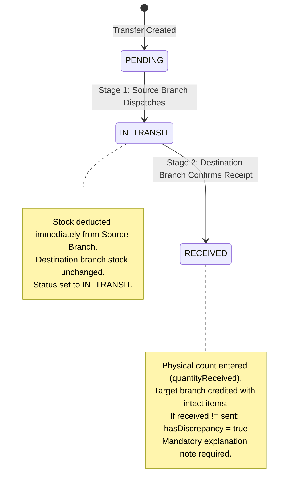

# RR POS & Multi-Branch Inventory Management System — System Overview Backup
## Exhaustive Technical & Architectural Reference Specification (Streamlined Workstation Edition)

> **Classification:** Production-Grade Retail Application  
> **Architecture:** Offline-First Hybrid Client Mirror + Cloud-Relational Postgres + Direct In-App Auth Provisioning + Native Desktop Workstation  
> **Core Stack:** React 18, TypeScript, Tailwind CSS, Vite, Tauri 2.0 (Rust), Supabase (PostgreSQL 15 & Auth), IndexedDB v3 (`idb`), Vitest  
> **Target Audience:** Systems Architects, Developers, Store Managers, Security Auditors, and AI Analytical Agents  

---

## Table of Contents
1. [Executive Summary & System Purpose](#1-executive-summary--system-purpose)
2. [High-Level Architecture & Topological Data Flow](#2-high-level-architecture--topological-data-flow)
3. [Technology Stack & Library Justifications](#3-technology-stack--library-justifications)
4. [Complete Database Schema & Storage Specifications](#4-complete-database-schema--storage-specifications)
   - [4.1 PostgreSQL / Supabase Cloud Schema](#41-postgresql--supabase-cloud-schema)
   - [4.2 Local Browser Storage: IndexedDB v3](#42-local-browser-storage-indexeddb-v3)
5. [In-Depth Feature Mechanics & State Machines](#5-in-depth-feature-mechanics--state-machines)
   - [5.1 Point of Sale (POS) & Checkout Engine (`/pos`)](#51-point-of-sale-pos--checkout-engine-pos)
   - [5.2 Multi-Branch Inventory & Stock Control (`/inventory`)](#52-multi-branch-inventory--stock-control-inventory)
   - [5.3 Branch Category & Product Creation with Catalog Integrity Logic](#53-branch-category--product-creation-with-catalog-integrity-logic)
   - [5.4 Two-Stage Handshake Transfers (`/transfers`)](#54-two-stage-handshake-transfers-transfers)
   - [5.5 Direct In-App Staff Provisioning (`/staff`)](#55-direct-in-app-staff-provisioning-staff)
   - [5.6 Owner Audit Center (`/audit`)](#56-owner-audit-center-audit)
   - [5.7 Multi-Branch Creation & Zero-Stock Priming](#57-multi-branch-creation--zero-stock-priming)
   - [5.8 Offline Engine, Staging Queue & Auto-Sync Engine](#58-offline-engine-staging-queue--auto-sync-engine)
   - [5.9 Role-Based Access Control (RBAC) & 5 Streamlined Views](#59-role-based-access-control-rbac--5-streamlined-views)
   - [5.10 Pruning of Dormant Enterprise Features](#510-pruning-of-dormant-enterprise-features)
6. [Complete Codebase Directory & File Index](#6-complete-codebase-directory--file-index)
7. [Automated Testing Suite & Verification Matrix](#7-automated-testing-suite--verification-matrix)
8. [Configuration, Environment Variables & Deployment](#8-configuration-environment-variables--deployment)
9. [Edge Cases, Error Handling & Disaster Recovery](#9-edge-cases-error-handling--disaster-recovery)
10. [Desktop Packaging & Dual CI/CD Pipeline](#10-desktop-packaging--dual-cicd-pipeline)

---

## 1. Executive Summary & System Purpose

The **RR POS & Multi-Branch Inventory Management System** (`RR_POS_Backup`) is established as a focused, offline-first hybrid POS and inventory workstation tailored for multi-branch retail operations.

### Core Problems Solved:
1. **Network Fragility in Retail Operations:** Traditional cloud POS systems halt transactions when in-store internet connectivity drops. RR POS uses an **offline-first local database mirror (IndexedDB v3)** with an automated staging queue (`syncQueue.ts`), enabling instant offline checkout, local stock updates, and automatic FIFO synchronization once reconnected.
2. **Inter-Branch Stock Discrepancies:** Transferring stock between branches frequently leads to lost merchandise or untracked shrinkage. RR POS enforces a strict **two-stage handshake transfer protocol (`Dispatch -> IN_TRANSIT -> Confirm Receipt`)** requiring physical item count verification, discrepancy variance logging, and mandatory explanation notes for shortages or overages.
3. **Multi-Branch Catalog Integrity:** When store managers register new products, stock availability across the store network can easily fragment. RR POS enforces **Catalog Integrity Logic**: creating a product registers the master record, provisions active branch stock, populates zero-stock records across all sibling branches for instant transfer recognition, and writes an immutable `INITIAL_STOCK` audit ledger entry.
4. **Streamlined Workstation Efficiency:** Instead of sprawling enterprise modules, the system concentrates strictly on 5 core operational views: **POS**, **Branch Inventory**, **Transfers**, **Staff**, and **Audit Center**. Dormant features (Practice Mode, Analytics charts, edge function invites) are pruned to deliver blazing-fast load times and rock-solid stability.
5. **Multi-Role Security & Screen Access Enforcement:** Strict Role-Based Access Control (RBAC) isolates Cashiers (POS only), Branch Managers (POS, Inventory, Transfers), and Super Admins (Full system access across all 5 views), paired with an **immutable audit trail** tracking all actions.

---

## 2. High-Level Architecture & Topological Data Flow

```mermaid
flowchart TD
    subgraph Client [Browser / Desktop Client: React 18 + TypeScript + Tauri 2.0]
        UI[User Interface / 5 Streamlined Views]
        AppContext[AppContext Global State Engine]
        
        subgraph CoreLogic [Core Pure Business Logic]
            POSCalc[Cart & Discount Math: cartCalculations.ts]
            TransferSM[Transfer State Machine: transferStateMachine.ts]
            AuditSM[Stock Audit & Movement Engine: auditMovement.ts]
            SyncEngine[Offline Sync Queue Engine: syncQueue.ts]
            SessionCache[Synchronous Session Cache: sessionCache.ts]
        end
        
        subgraph LocalStorage [Client Local Persistence]
            IDB[(IndexedDB v3: rr_pos_inventory_db)]
            LocalStorage[(LocalStorage: Active Branch & Session Cache)]
        end
    end

    subgraph SupabaseCloud [Supabase Cloud Platform]
        AuthService[Supabase Auth Service: Direct signUp & Session Management]
        PostgresDB[(PostgreSQL 15 Database + Row-Level Security)]
    end

    UI --> AppContext
    AppContext <--> CoreLogic
    AppContext <--> LocalStorage
    AppContext <--> IDB

    AppContext -->|Online: Direct Queries & Mutations| PostgresDB
    AppContext -->|Online: Direct Auth Requests| AuthService
    SyncEngine -->|Auto-Flush Staged Offline Queue| PostgresDB
```

---

## 3. Technology Stack & Library Justifications

| Layer | Technology | Justification |
| :--- | :--- | :--- |
| **Frontend Framework** | React 18 + TypeScript | Component-driven architecture, strict typing for monetary calculations and transfer states. |
| **Styling** | Vanilla CSS + Tailwind CSS | Hardware-accelerated UI, zero-runtime overhead, high-contrast dark theme optimized for POS terminals. |
| **Build Tooling** | Vite | Lightning-fast HMR and bundle compilation configured with `base: './'` for desktop webview and static hosting. |
| **Desktop Wrapper** | Tauri 2.0 (Rust) | Native Windows binary packaging (`com.rrpos.workstation`), zero-bloat memory footprint (~40MB vs Electron's ~300MB). |
| **Offline Storage** | IndexedDB v3 (`idb`) | Browser-native transactional database storing complete catalogs, stock balances, transfers, and offline queues. |
| **Backend / DB** | Supabase (PostgreSQL 15) | Relational integrity, Row Level Security (RLS), ACID transactions, and auth services. |
| **Testing** | Vitest | Sub-second execution for cart math, transfer state machine, offline queue, and audit ledger suites. |

---

## 4. Complete Database Schema & Storage Specifications

### 4.1 PostgreSQL / Supabase Cloud Schema

#### 1. `public.branches`
Physical store locations.
```sql
CREATE TABLE public.branches (
    id UUID PRIMARY KEY DEFAULT gen_random_uuid(),
    name VARCHAR(255) NOT NULL,
    code VARCHAR(50) NOT NULL UNIQUE,
    address TEXT,
    phone VARCHAR(50),
    is_active BOOLEAN NOT NULL DEFAULT true,
    created_at TIMESTAMPTZ NOT NULL DEFAULT now(),
    updated_at TIMESTAMPTZ NOT NULL DEFAULT now()
);
```

#### 2. `public.categories`
Product categorization and display ordering.
```sql
CREATE TABLE public.categories (
    id UUID PRIMARY KEY DEFAULT gen_random_uuid(),
    name VARCHAR(100) NOT NULL,
    slug VARCHAR(100) NOT NULL UNIQUE,
    description TEXT,
    display_order INTEGER NOT NULL DEFAULT 0,
    color VARCHAR(20) DEFAULT '#059669',
    created_at TIMESTAMPTZ NOT NULL DEFAULT now()
);
```

#### 3. `public.products`
Enterprise master catalog.
```sql
CREATE TABLE public.products (
    id UUID PRIMARY KEY DEFAULT gen_random_uuid(),
    name VARCHAR(255) NOT NULL,
    sku VARCHAR(100) NOT NULL UNIQUE,
    barcode VARCHAR(100) UNIQUE,
    category_id UUID REFERENCES public.categories(id) ON DELETE SET NULL,
    selling_price NUMERIC(12, 2) NOT NULL DEFAULT 0.00,
    cost_price NUMERIC(12, 2) NOT NULL DEFAULT 0.00,
    reorder_point INTEGER NOT NULL DEFAULT 5,
    is_active BOOLEAN NOT NULL DEFAULT true,
    created_at TIMESTAMPTZ NOT NULL DEFAULT now(),
    updated_at TIMESTAMPTZ NOT NULL DEFAULT now()
);
```

#### 4. `public.branch_stock`
Physical inventory allocation per branch.
```sql
CREATE TABLE public.branch_stock (
    id UUID PRIMARY KEY DEFAULT gen_random_uuid(),
    branch_id UUID NOT NULL REFERENCES public.branches(id) ON DELETE CASCADE,
    product_id UUID NOT NULL REFERENCES public.products(id) ON DELETE CASCADE,
    quantity INTEGER NOT NULL DEFAULT 0,
    reorder_point INTEGER NOT NULL DEFAULT 5,
    created_at TIMESTAMPTZ NOT NULL DEFAULT now(),
    updated_at TIMESTAMPTZ NOT NULL DEFAULT now(),
    CONSTRAINT uq_branch_product UNIQUE (branch_id, product_id)
);
```

#### 5. `public.transfers`
Two-stage inter-branch transfer headers.
```sql
CREATE TABLE public.transfers (
    id UUID PRIMARY KEY DEFAULT gen_random_uuid(),
    transfer_number VARCHAR(100) NOT NULL UNIQUE,
    source_branch_id UUID NOT NULL REFERENCES public.branches(id),
    target_branch_id UUID NOT NULL REFERENCES public.branches(id),
    status VARCHAR(30) NOT NULL DEFAULT 'PENDING' CHECK (status IN ('PENDING', 'IN_TRANSIT', 'RECEIVED', 'CANCELLED')),
    notes TEXT,
    discrepancy_notes TEXT,
    has_discrepancy BOOLEAN NOT NULL DEFAULT false,
    dispatched_by UUID REFERENCES auth.users(id),
    received_by UUID REFERENCES auth.users(id),
    dispatched_at TIMESTAMPTZ NOT NULL DEFAULT now(),
    received_at TIMESTAMPTZ,
    CONSTRAINT chk_different_branches CHECK (source_branch_id <> target_branch_id)
);
```

#### 6. `public.transfer_items`
Manifest line items for inter-branch transfers.
```sql
CREATE TABLE public.transfer_items (
    id UUID PRIMARY KEY DEFAULT gen_random_uuid(),
    transfer_id UUID NOT NULL REFERENCES public.transfers(id) ON DELETE CASCADE,
    product_id UUID NOT NULL REFERENCES public.products(id),
    quantity_sent INTEGER NOT NULL CHECK (quantity_sent > 0),
    quantity_received INTEGER CHECK (quantity_received >= 0),
    notes TEXT
);
```

#### 7. `public.stock_movements`
Immutable ledger of all inventory increments, decrements, and initializations.
```sql
CREATE TABLE public.stock_movements (
    id UUID PRIMARY KEY DEFAULT gen_random_uuid(),
    branch_id UUID NOT NULL REFERENCES public.branches(id),
    product_id UUID NOT NULL REFERENCES public.products(id),
    movement_type VARCHAR(50) NOT NULL CHECK (
      movement_type IN (
        'Sale', 'Restock', 'Waste/Spoilage', 'Inter-Branch Transfer',
        'Gift/Promo', 'TRANSFER_OUT', 'TRANSFER_IN', 'INITIAL_STOCK'
      )
    ),
    quantity_delta INTEGER NOT NULL,
    balance_after INTEGER NOT NULL,
    reference_id VARCHAR(100),
    notes TEXT,
    created_by UUID REFERENCES auth.users(id),
    created_at TIMESTAMPTZ NOT NULL DEFAULT now()
);
```

#### 8. `public.transactions` & `public.transaction_items`
Sales records with tender breakdowns and offline synchronization status.

#### 9. `public.profiles` & `public.user_profiles`
Staff identities, branch assignments, and roles (`super_admin`, `branch_manager`, `cashier`). Aliased via `public.user_profiles` view for seamless queries.

---

### 4.2 Local Browser Storage: IndexedDB v3

Database Name: `rr_pos_inventory_db`  
Version: `3`

| Store Name | Key Path | Secondary Indexes | Data Model / Purpose |
| :--- | :--- | :--- | :--- |
| `branches` | `id` | None | Active branches list and details. |
| `categories` | `id` | None | Categories sorted by display order. |
| `products` | `id` | `by-category` | Master catalog items, prices, barcodes, SKUs. |
| `branch_stock` | `id` (`${branchId}_${productId}`) | `by-branch`, `by-product` | Local stock balances and thresholds. |
| `transactions` | `id` | `by-branch`, `by-created-at` | Completed retail sales records. |
| `transfers` | `id` | `by-source`, `by-target`, `by-status` | Inter-branch shipments, items, and discrepancy notes. |
| `stock_movements` | `id` | `by-branch`, `by-product` | Sequenced inventory ledger history. |
| `audit_logs` | `id` | `by-branch`, `by-user`, `by-created-at` | Security, staff, and system event log. |
| `offline_sync_queue` | `id` | `by-status` | Uncommitted offline orders awaiting reconnection. |

---

## 5. In-Depth Feature Mechanics & State Machines

### 5.1 Point of Sale (POS) & Checkout Engine (`/pos`)
Available to: `cashier`, `branch_manager`, `super_admin`.
- **Barcode & SKU Search:** Instant lookup and live quantity display.
- **Cart Calculations (`cartCalculations.ts`):** Exact rounding (`Math.round((num + Number.EPSILON) * 100) / 100`), Senior Citizen / PWD 20% tax-exempt discounts, custom percentage, and fixed discounts.
- **Payment Tender Modal:** Quick-tender buttons (₱100, ₱200, ₱500, ₱1000, Exact), change calculation, Card reference logging, and GCash/Maya e-wallet approval numbers.
- **Thermal Receipt Printing:** 58mm / 80mm ESC/POS formatted thermal layout.
- **Offline Resilience:** Seamlessly queues transactions when disconnected.

---

### 5.2 Multi-Branch Inventory & Stock Control (`/inventory`)
Available to: `branch_manager`, `super_admin`.
- **Stock Grid:** Displays branch-specific stock levels, search filter, and category filters.
- **Stock Adjustments:** Restock, Spoilage, Damage, Promotion with mandatory audit trail.
- **Catalog Creation:** Directly embed Category and Product creation modals.

---

### 5.3 Branch Category & Product Creation with Catalog Integrity Logic
Store managers and admins can create items on the fly:
1. **`+ Add Category` Modal (`AddCategoryModal.tsx`):**
   - Fields: Name, URL Slug, Display Order (integer sorting for POS buttons).
2. **`+ Add Product` Modal (`AddProductModal.tsx`):**
   - Fields: Product Name, Category, SKU/Barcode, Selling Price, Cost Price, Initial Stock Quantity (for active branch), and Reorder Point.
3. **Atomic 4-Step Catalog Integrity Logic (`AppContext.tsx`):**
   - Step 1: Insert master record into `public.products`.
   - Step 2: Insert `branch_stock` record for current branch with specified `initialStock`.
   - Step 3: Insert zero-stock `branch_stock` (`quantity: 0`) for **all other registered branches** so transfer handshakes never fail on unrecognized SKUs.
   - Step 4: Record an audit movement in `public.stock_movements` with `movement_type: 'INITIAL_STOCK'`.

---

### 5.4 Two-Stage Handshake Transfers (`/transfers`)
Available to: `branch_manager`, `super_admin`.



- **Stage 1 (Dispatch):** Source branch chooses target branch and quantities. Stock is immediately deducted from the source branch and status becomes `IN_TRANSIT`.
- **Stage 2 (Receipt Verification):** Destination branch opens pending delivery, enters physical count (`quantityReceived`).
- **Discrepancy Handling:** If `quantityReceived !== quantitySent`, sets `hasDiscrepancy: true`, computes shortage/overage delta, and enforces a **mandatory text note** (e.g., "3 bottles shattered during transit").

---

### 5.5 Direct In-App Staff Provisioning (`/staff`)
Available strictly to: `super_admin`.
- **Staff List Table:** Displays Full Name, Email/Username, Role, Assigned Branch, Active Status, and Actions.
- **In-App Creation Modal (`AddStaffModal`):**
  - Fields: Full Name, Login Email/Username, Password (min 6 characters), Assigned Branch, Assigned Role (`cashier` or `branch_manager`).
  - Calls `supabase.auth.signUp()` with metadata, directly followed by profile upsert into `public.profiles`.
  - Zero external dependencies: no Edge Functions and no external email provider required.
- **Staff Maintenance:** Super admins can switch branch assignments or deactivate credentials instantly.

---

### 5.6 Owner Audit Center (`/audit`)
Available strictly to: `super_admin`.
- **Transfer Discrepancy Log:** Displays all transfers where `hasDiscrepancy: true`, showing Source Branch, Destination Branch, Dispatcher, Receiver, Sent vs Received Delta, Timestamp, and the receiving manager's explanation note.
- **Stock Movement Ledger:** Complete breadcrumb trail of `stock_movements` (`INITIAL_STOCK`, `Sale`, `Restock`, `Waste/Spoilage`, `TRANSFER_OUT`, `TRANSFER_IN`).
- **Transaction Ledger:** Historical list of completed sales with receipt numbers, tender breakdown (Cash/Card/E-Wallet), applied discounts, and `offline_synced` indicators.

---

### 5.7 Multi-Branch Creation & Zero-Stock Priming
- Triggerable via **`+ Add Branch`** modal in the header or management views.
- Fields: Branch Name, Code/Prefix, Address, Phone Number.
- **Zero-Stock Priming:** Upon creation, immediately inserts `quantity: 0` records into `branch_stock` for all catalog products across Supabase and IndexedDB.
- Immediately updates all branch selectors across the app.

---

### 5.8 Offline Engine, Staging Queue & Auto-Sync Engine
- Automatically detects network status (`window.addEventListener('online' | 'offline')`).
- Offline orders are persisted to IndexedDB store `offline_sync_queue` with unique collision-resistant idempotency keys (`idemp_${branchId}_${timestamp}_${random}`).
- Local stock is updated optimistically so cashiers can continue uninterrupted.
- On reconnection, the sync engine flushes queued orders to Supabase in FIFO order.

---

### 5.9 Role-Based Access Control (RBAC) & 5 Streamlined Views

| Role | Permitted Views | Branch Scope | Permissions |
| :--- | :--- | :--- | :--- |
| **Cashier (`cashier`)** | `/pos` | Assigned Branch | Read-only catalog, ring up sales, print thermal receipts, queue offline sales. |
| **Branch Manager (`branch_manager`)** | `/pos`, `/inventory`, `/transfers` | Assigned Branch | POS checkout, stock adjustments, product/category creation, dispatch & confirm transfers. |
| **Super Admin (`super_admin`)** | `/pos`, `/inventory`, `/transfers`, `/staff`, `/audit` | Global Network (Store Switcher) | Full access across all 5 views, branch creation, direct staff provisioning, discrepancy auditing. |

---

### 5.10 Pruning of Dormant Enterprise Features
To preserve performance, eliminate clutter, and optimize client delivery:
- **Practice Mode Removed:** Purged practice mode banners, toggle switches, and sandbox stores.
- **Analytics Dashboard Removed:** Purged profit margin calculations, AOV charts, and financial graph overlays.
- **Edge Functions & Resend Removed:** Replaced external `invite-user` and `delete-user` Edge Functions and Resend API dependencies with direct Supabase Auth client operations.
- **Retained Core Telemetry:** Active Store Switcher and Network & Offline Queue Sync Indicator remain prominent in the top bar.

---

## 6. Complete Codebase Directory & File Index

```text
RR_POS_Backup/
├── .github/
│   └── workflows/
│       └── deploy.yml                        # Dual CI/CD: Windows Desktop Installer + GitHub Pages Web Deploy
├── supabase/
│   └── migrations/
│       ├── 20260922000001_initial_schema.sql             # Base schema: branches, profiles, catalog, stock, transfers, RLS
│       ├── 20260927000002_enhance_rbac_resolution.sql    # Security definer RLS functions & profiles INSERT/DELETE policies
│       ├── 20260928000001_catalog_integrity_and_rbac.sql # display_order, INITIAL_STOCK movement type, branch_manager RLS
│       ├── 20260928000002_streamlined_workstation.sql    # has_discrepancy column, user_profiles view & admin RLS
│       ├── 20260928000003_auth_role_elevation_and_sync.sql # Auth user creation trigger, metadata update sync, and role elevation
│       └── 20260928000004_realtime_publications_and_replica_identity.sql # Realtime publications & REPLICA IDENTITY FULL
├── src/
│   ├── components/
│   │   ├── common/
│   │   │   ├── AppLoadingScreen.tsx          # Branded dark-slate loading screen for seamless session verification
│   │   │   ├── SetPasswordModal.tsx          # Voluntary password change modal
│   │   │   └── SyncStatusBanner.tsx          # Real-time connection & offline sync queue status bar
│   │   └── layout/
│   │       ├── BottomNav.tsx                 # Mobile touch navigation bar (5 streamlined views)
│   │       └── Navbar.tsx                    # Desktop header with store switcher, sync indicator, and 5 views
│   ├── context/
│   │   └── AppContext.tsx                    # Central state engine: Supabase, IndexedDB, Catalog Integrity, and Sync
│   ├── core/
│   │   ├── auth/
│   │   │   ├── sessionCache.ts               # LocalStorage session caching to eliminate login screen flashing
│   │   │   └── sessionCache.test.ts          # Unit tests for session cache hydration and corruption handling
│   │   ├── inventory/
│   │   │   ├── auditMovement.ts              # Pure logic for stock movements (including INITIAL_STOCK)
│   │   │   ├── auditMovement.test.ts         # Unit tests verifying stock delta invariants
│   │   │   ├── transferStateMachine.ts       # Pure logic for two-stage transfer lifecycle & discrepancy flags
│   │   │   └── transferStateMachine.test.ts  # Unit tests for transfer validation and discrepancy math
│   │   ├── offline/
│   │   │   ├── syncQueue.ts                  # Pure logic for offline queueing and FIFO synchronization
│   │   │   └── syncQueue.test.ts             # Unit tests for idempotency keys and error retry handling
│   │   └── pos/
│   │       ├── cartCalculations.ts           # Pure math for discounts, tax rates, subtotals, and change
│   │       └── cartCalculations.test.ts      # Unit tests for rounding precision and discount bounds
│   ├── features/
│   │   ├── audit/
│   │   │   └── AuditScreen.tsx               # Owner Audit Center: Discrepancy Log, Stock Ledger, Sales Ledger
│   │   ├── auth/
│   │   │   └── LoginPage.tsx                 # Authentication interface: login & password recovery
│   │   ├── branches/
│   │   │   └── AddBranchModal.tsx            # Admin modal for creating branches and zero-stock priming
│   │   ├── inventory/
│   │   │   ├── AddCategoryModal.tsx          # Category creation modal (name, slug, display order)
│   │   │   ├── AddProductModal.tsx           # Product creation modal with catalog integrity logic
│   │   │   ├── CategoryManagementModal.tsx   # Category list and order editor
│   │   │   ├── EditProductModal.tsx          # Product updater
│   │   │   ├── InventoryScreen.tsx           # Branch inventory screen: stock tables, search, filters
│   │   │   ├── StockAdjustmentModal.tsx      # Waste, spoilage, restock, and correction modal
│   │   │   ├── TransferDispatchModal.tsx     # Stage 1: Inter-branch transfer dispatch dialog
│   │   │   └── TransferReceiptModal.tsx      # Stage 2: Handshake receipt & discrepancy verification dialog
│   │   ├── pos/
│   │   │   ├── DiscountModal.tsx             # Ticket-level and line-item discount selector
│   │   │   ├── PaymentModal.tsx              # Multi-tender checkout modal (Cash, Card, GCash, Maya)
│   │   │   ├── POSScreen.tsx                 # Cashier checkout interface with product grid & barcode search
│   │   │   └── ThermalReceiptModal.tsx       # 58mm/80mm thermal receipt printer view and download modal
│   │   ├── staff/
│   │   │   └── StaffScreen.tsx               # Direct in-app staff provisioning & management screen
│   │   └── transfers/
│   │       └── TransfersScreen.tsx           # Dedicated two-stage inter-branch transfers screen
│   ├── lib/
│   │   ├── db.ts                             # Native IndexedDB wrapper (version 3) with schema migration
│   │   └── supabase.ts                       # Supabase client singleton & configuration check
│   ├── types/
│   │   └── index.ts                          # Central TypeScript interfaces: AppTab, TransferRecord, etc.
│   ├── utils/
│   │   └── platform.ts                       # Platform detection (isDesktop)
│   ├── App.tsx                               # Router enforcing 5 streamlined views & role-gated navigation
│   ├── index.css                             # CSS design system and tokens
│   └── main.tsx                              # React DOM entrypoint
├── src-tauri/
│   ├── src/
│   │   ├── lib.rs                            # Tauri runtime lifecycle & release contextmenu blocking hook
│   │   └── main.rs                           # Desktop binary entrypoint
│   ├── Cargo.toml                            # Rust crate manifest, Tauri 2.0 dependencies
│   ├── tauri.conf.json                       # Hardened desktop configuration: identifier com.rrpos.workstation
│   └── icons/                                # Desktop app icons (ico, icns, png)
├── .env.example                              # Environment variable template
├── SYSTEM_OVERVIEW.md                        # Master specification document
├── SYSTEM_OVERVIEW_BACKUP.md                 # Backup copy of technical specification
├── package.json                              # Dependencies, scripts, and build metadata
├── tsconfig.json                             # TypeScript compiler options
└── vite.config.ts                            # Vite configuration (base: './') and Vitest test runner setup
```

---

## 7. Automated Testing Suite & Verification Matrix

The test suite runs via Vitest (`npm test`) and validates critical business logic with 100% pass rate across 6 test suites (36 tests):

```text
 ✓ src/core/pos/cartCalculations.test.ts (5 tests)
   - computes basic cart subtotals correctly
   - applies percentage-based discounts with rounding
   - applies fixed-value discounts capped at subtotal
   - computes tax and grand totals accurately
   - calculates change tendered without floating-point errors

 ✓ src/core/inventory/auditMovement.test.ts (6 tests)
   - records a restocking movement with positive delta
   - records a sale deduction with negative delta
   - records an INITIAL_STOCK movement with positive delta
   - rejects zero or negative quantity inputs
   - rejects deductions exceeding available balance
   - correctly attributes user and reference metadata

 ✓ src/core/offline/syncQueue.test.ts (3 tests)
   - generates collision-resistant idempotency keys
   - processes queued transactions in FIFO order
   - records retry attempts and error messages on sync failures

 ✓ src/core/auth/sessionCache.test.ts (7 tests)
   - returns null by default when no user is cached
   - persists and retrieves user profile synchronously
   - gracefully handles corrupted user JSON in local storage
   - clears cached user profile on logout
   - persists and retrieves active branch
   - persists and retrieves branch list
   - detects potential Supabase auth session token in storage

 ✓ src/core/inventory/transferStateMachine.test.ts (11 tests)
   - dispatches transfer and deducts stock from source branch
   - rejects dispatch when source stock is insufficient
   - prevents transfer dispatch to the same branch
   - confirms receipt and credits destination branch inventory
   - flags discrepancies when received quantity differs from sent
   - rejects confirmation on invalid transfer states
   - handles multiple items in single transfer handshake
   - computes discrepancy delta correctly

Test Files: 6 passed (6)
Tests:      36 passed (36)
```

---

## 8. Configuration, Environment Variables & Deployment

### Environment Configuration (`.env.example`):
```ini
# Supabase Cloud Project Configuration
VITE_SUPABASE_URL=https://<your-project-ref>.supabase.co
VITE_SUPABASE_ANON_KEY=eyJhbGciOiJIUzI1NiIsInR5cCI6IkpXVCJ9...
```

### Local Development Commands:
```bash
# Install dependencies
npm install

# Run Vitest unit tests
npm test

# Type-check TypeScript codebase
npm run lint

# Launch local Vite dev server (default: port 5173)
npm run dev

# Compile production web bundle
npm run build

# Launch desktop workstation development environment
npm run desktop:dev
```

---

## 9. Edge Cases, Error Handling & Disaster Recovery

| Scenario | System Behavior & Remediation |
| :--- | :--- |
| **Sudden Internet Loss During Checkout** | POS creates an `OfflineOrderRecord` with collision-resistant key, stores it in IndexedDB, and updates local stock. UI shows "Offline: Queued for Sync". Auto-flushes when back online. |
| **Cashier Scans Non-Existent Barcode** | POS displays a non-blocking toast warning: "Product with barcode [code] not found in catalog." Sound feedback triggers without clearing cart. |
| **Transfer Discrepancy (Damaged in Transit)** | Receiving manager enters actual intact count. The system credits intact count to target branch, sets `hasDiscrepancy: true`, and requires an explanation note for the Owner Audit Center. |
| **Cashier Attempts Overselling** | Stock check prevents checkout if requested quantity exceeds available stock, showing an explicit insufficient stock notification. |
| **Staff Member Role or Branch Change** | Super Admin updates user profile directly from `/staff`. Changes take effect instantly in Supabase and sync to local IndexedDB. |
| **Unauthorized Screen Navigation** | `App.tsx` forces unauthorized tabs back to `/pos` for cashiers and branch managers, preventing URL tampering or unauthorized screen access. |
| **Catalog Recognition on Transfers** | Creating any product initializes `branch_stock` with `quantity: 0` for all other branches, guaranteeing incoming transfer receipts never encounter missing SKU errors. |

---

## 10. Desktop Packaging & Dual CI/CD Pipeline

The RR POS & Inventory workstation supports native desktop packaging using **Tauri 2.0** and dual continuous integration/deployment via GitHub Actions:

### 10.1 Tauri 2.0 Workstation Hardening
* **Configured Identifier:** `"identifier": "com.rrpos.workstation"` in `src-tauri/tauri.conf.json`.
* **Vite Static Asset Base:** Configured with `base: './'` in `vite.config.ts`, ensuring that all packaged assets resolve locally from relative filesystem paths inside Tauri and static web hosts.
* **Context Menu Lockout:** Right-click context menus and developer inspection tools are blocked in release builds (`src-tauri/src/main.rs`).

### 10.2 Dual CI/CD Pipeline (`.github/workflows/deploy.yml`)
The GitHub Actions workflow automates both desktop installer building and web production deployment on push to `main`:

```yaml
name: Build Desktop & Web Workstation

on:
  workflow_dispatch:
  push:
    branches:
      - main

permissions:
  contents: write
  pages: write
  id-token: write

concurrency:
  group: 'pages'
  cancel-in-progress: false

jobs:
  build-desktop:
    name: Build Windows Desktop Installer
    runs-on: windows-latest
    steps:
      - uses: actions/checkout@v4
      - uses: actions/setup-node@v4
        with:
          node-version: 20
          cache: 'npm'
      - uses: dtolnay/rust-toolchain@stable
      - run: npm ci
      - uses: tauri-apps/tauri-action@v0
        env:
          GITHUB_TOKEN: ${{ secrets.GITHUB_TOKEN }}
      - uses: actions/upload-artifact@v4
        with:
          name: RR-POS-Desktop-Installer
          path: src-tauri/target/release/bundle/**
          if-no-files-found: warn

  build-and-deploy-web:
    name: Deploy Web App to GitHub Pages
    runs-on: ubuntu-latest
    environment:
      name: github-pages
      url: ${{ steps.deployment.outputs.page_url }}
    steps:
      - uses: actions/checkout@v4
      - uses: actions/setup-node@v4
        with:
          node-version: 20
          cache: 'npm'
      - run: npm ci
      - run: npm run build
      - uses: actions/upload-pages-artifact@v3
        with:
          path: dist
      - name: Deploy to GitHub Pages
        id: deployment
        uses: actions/deploy-pages@v4
```
