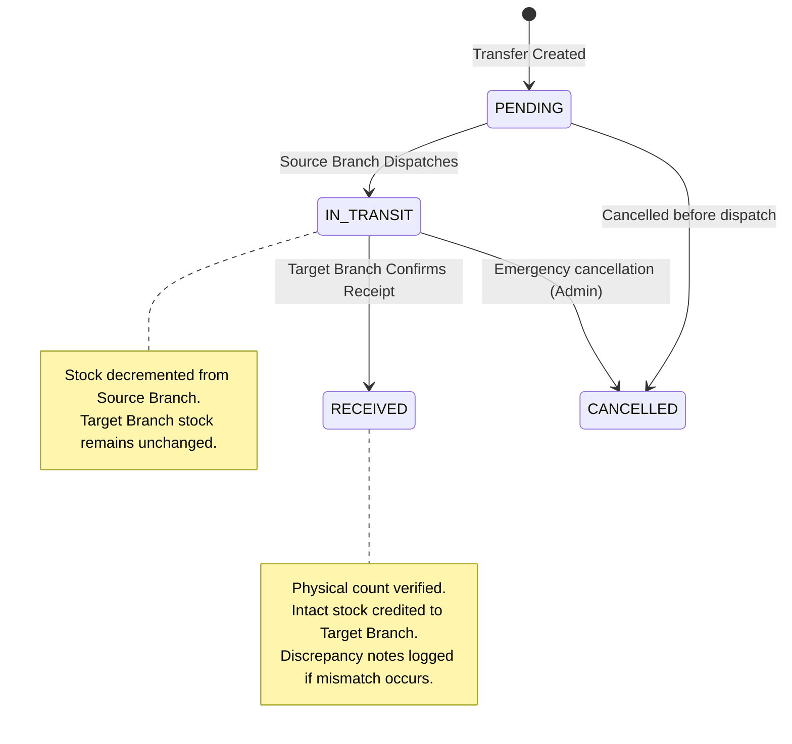

# RR POS & Multi-Branch Inventory Management System — System Overview Backup
## Exhaustive Technical & Architectural Reference Specification (Backup Workstation Edition)

> **Classification:** Production-Grade Retail Application  
> **Architecture:** Hybrid Cloud-Relational + Offline-First Client Mirror + Supabase Edge Functions + Standalone Native Workstation  
> **Core Stack:** React 18, TypeScript, Tailwind CSS, Vite, Tauri 2.0 (Rust), Supabase (PostgreSQL 15 & Edge Functions), Resend API, IndexedDB v3 (`idb`), Vitest  
> **Target Audience:** Systems Architects, Developers, Store Managers, Security Auditors, and AI Analytical Agents  

---

## Table of Contents
1. [Executive Summary & System Purpose](#1-executive-summary--system-purpose)
2. [High-Level Architecture & Topological Data Flow](#2-high-level-architecture--topological-data-flow)
3. [Technology Stack & Library Justifications](#3-technology-stack--library-justifications)
4. [Complete Database Schema & Storage Specifications](#4-complete-database-schema--storage-specifications)
   - [4.1 PostgreSQL / Supabase Cloud Schema (11 Tables)](#41-postgresql--supabase-cloud-schema-11-tables)
   - [4.2 Local Browser Storage: IndexedDB v3 (9 Stores)](#42-local-browser-storage-indexeddb-v3-9-stores)
5. [In-Depth Feature Mechanics & State Machines](#5-in-depth-feature-mechanics--state-machines)
   - [5.1 Point of Sale (POS) & Checkout Engine](#51-point-of-sale-pos--checkout-engine)
   - [5.2 Multi-Branch Inventory & Stock Control](#52-multi-branch-inventory--stock-control)
   - [5.3 Branch Category & Product Creation with Catalog Integrity Logic](#53-branch-category--product-creation-with-catalog-integrity-logic)
   - [5.4 Inter-Branch Transfer Protocol & State Machine](#54-inter-branch-transfer-protocol--state-machine)
   - [5.5 Granular Per-Store Practice Mode (Sandbox)](#55-granular-per-store-practice-mode-sandbox)
   - [5.6 Dynamic Branch Management (CRUD) & Validation](#56-dynamic-branch-management-crud--validation)
   - [5.7 Authentication, Edge Provisioning & Staff Management](#57-authentication-edge-provisioning--staff-management)
   - [5.8 Offline Engine, Staging Queue & Auto-Sync Engine](#58-offline-engine-staging-queue--auto-sync-engine)
   - [5.9 Real-Time Audit Trail & Compliance Monitoring](#59-real-time-audit-trail--compliance-monitoring)
   - [5.10 Business Analytics & Financial Reporting](#510-business-analytics--financial-reporting)
   - [5.11 Role-Based Access Control (RBAC) & Screen Access Policy](#511-role-based-access-control-rbac--screen-access-policy)
6. [Complete Codebase Directory & File Index](#6-complete-codebase-directory--file-index)
7. [Automated Testing Suite & Verification Matrix](#7-automated-testing-suite--verification-matrix)
8. [Configuration, Environment Variables & Deployment](#8-configuration-environment-variables--deployment)
9. [Edge Cases, Error Handling & Disaster Recovery](#9-edge-cases-error-handling--disaster-recovery)
10. [Desktop Packaging & Dual CI/CD Pipeline](#10-desktop-packaging--dual-cicd-pipeline)

---

## 1. Executive Summary & System Purpose

The **RR POS & Multi-Branch Inventory Management System** is an enterprise-grade retail workstation and inventory platform tailored for retail store chains, franchise outlets, and multi-location convenience markets. 

### Core Problems Solved:
1. **Network Fragility in Retail Operations:** Traditional cloud POS systems halt transactions when in-store internet connectivity drops. RR POS uses an **offline-first local database mirror (IndexedDB v3)** with an automated staging queue, enabling seamless checkout and inventory deductions during network outages.
2. **Inter-Branch Stock Discrepancies:** Transferring stock between branches frequently leads to lost merchandise or untracked shrinkage. RR POS enforces a strict **two-step transfer state machine (`PENDING` $\to$ `IN_TRANSIT` $\to$ `RECEIVED`)** requiring physical item inspection, receipt confirmation, and discrepancy logging.
3. **Multi-Branch Catalog Integrity:** When store managers register new products, stock availability across the store network can easily fragment. RR POS enforces **Catalog Integrity Logic**: creating a product registers the master record, provisions active branch stock, populates zero-stock records across all sibling branches for instant transfer recognition, and writes an immutable `INITIAL_STOCK` audit ledger entry.
4. **Staff Training Contamination:** Training new cashiers in live retail systems often creates bogus sales records that pollute revenue and tax reports. RR POS features **Store-Level Practice Sandbox Mode**, which isolates training data to the browser storage for designated branches and automatically purges all practice records upon completion.
5. **Multi-Role Security & Screen Access Enforcement:** Strict Role-Based Access Control (RBAC) isolates Cashiers (POS only), Branch Managers (POS, Inventory & Transfers), and Super Admins (Full system, Branch Switcher, Owner Audit Center), paired with an **immutable audit trail** tracking all actions.

---

## 2. High-Level Architecture & Topological Data Flow

```mermaid
flowchart TD
    subgraph Client [Browser / Desktop Client: React 18 + TypeScript + Tauri 2.0]
        UI[User Interface / React Views]
        AppContext[AppContext Global State Engine]
        
        subgraph CoreLogic [Core Pure Business Logic]
            POSCalc[Cart & Discount Math]
            TransferSM[Transfer State Machine]
            AuditSM[Stock Audit & Delta Engine]
            SyncEngine[Offline Sync Queue Engine]
            SandboxEngine[Practice Sandbox Manager]
        end
        
        subgraph LocalStorage [Client Local Persistence]
            IDB[(IndexedDB v3: rr_pos_inventory_db)]
            LocalStorage[(LocalStorage: Practice Settings & Auth Tokens)]
        end
    end

    subgraph SupabaseCloud [Supabase Cloud Platform]
        subgraph EdgeFunctions [Supabase Edge Functions: Deno / TypeScript]
            InviteFn[invite-user/index.ts: Multi-Tier Provisioning & Link Generator]
            DeleteFn[delete-user/index.ts: Staff Deletion & Session Revocation]
        end

        AuthService[Supabase Auth Service: JWT & Admin API]
        PostgresDB[(PostgreSQL 15 Database + RLS)]
    end

    subgraph ExternalServices [Third-Party APIs & Gateways]
        ResendAPI[Resend API: Transactional Email Gateway]
    end

    UI --> AppContext
    AppContext <--> CoreLogic
    AppContext <--> LocalStorage
    AppContext <--> IDB

    AppContext -->|Online: Realtime API Calls| PostgresDB
    AppContext -->|Online: Auth Requests| AuthService
    SyncEngine -->|Auto-Flush Staged Offline Queue| PostgresDB

    UI -->|Admin: supabase.functions.invoke 'invite-user'| InviteFn
    UI -->|Admin: supabase.functions.invoke 'delete-user'| DeleteFn
    InviteFn -->|Service Role Admin API| AuthService
    InviteFn -->|Service Role Upsert| PostgresDB
    InviteFn -->|Direct Dispatch| ResendAPI
    DeleteFn -->|Service Role Delete User| AuthService
    DeleteFn -->|Service Role Delete Profile| PostgresDB
```

---

## 3. Technology Stack & Library Justifications

| Layer | Technology | Justification & Architectural Fit |
| :--- | :--- | :--- |
| **Frontend Framework** | React 18 (TypeScript) | Declarative UI, Strict typing, concurrent rendering capabilities, enterprise maintainability. |
| **Desktop Runtime** | Tauri 2.0 (Rust) | Zero Chromium overhead, native OS WebView rendering, sub-50MB memory footprint, hardened OS security boundary (`com.rrpos.workstation`). |
| **Styling & Design System** | Tailwind CSS + Lucide React | High-velocity utility classes, consistent dark slate aesthetic, customized touch-friendly components. |
| **Build & Bundler** | Vite 6 | Sub-second HMR, optimized Rollup bundling with relative asset resolution (`base: './'`) for static hosting and offline desktop workstation modes. |
| **Local Persistence** | IndexedDB v3 (`idb`) | Durable client-side relational storage, structured object stores, indexed lookups, offline operation. |
| **Backend & Database** | Supabase (PostgreSQL 15) | Relational integrity, foreign key cascading, Row Level Security (RLS), Realtime replication. |
| **Serverless Compute** | Supabase Edge Functions (Deno) | Zero-cold-start TypeScript edge lambdas for privileged admin operations (user invite/delete). |
| **Email Gateway** | Resend API | Reliable delivery of transactional onboarding invites with branded HTML templates and fallback link generation. |
| **Testing Framework** | Vitest | High-speed unit testing sharing Vite configuration, comprehensive test runner for pure core logic. |
| **CI/CD** | GitHub Actions | Dual pipeline compiling native Windows desktop installers and deploying web distribution to GitHub Pages. |

---

## 4. Complete Database Schema & Storage Specifications

### 4.1 PostgreSQL / Supabase Cloud Schema (11 Tables)

#### 1. `public.branches`
Defines physical and virtual branch locations.
```sql
CREATE TABLE public.branches (
    id UUID PRIMARY KEY DEFAULT gen_random_uuid(),
    code VARCHAR(50) NOT NULL UNIQUE,
    name VARCHAR(255) NOT NULL,
    address TEXT,
    phone VARCHAR(50),
    is_active BOOLEAN NOT NULL DEFAULT true,
    is_practice_mode BOOLEAN NOT NULL DEFAULT false,
    created_at TIMESTAMPTZ NOT NULL DEFAULT now(),
    updated_at TIMESTAMPTZ NOT NULL DEFAULT now()
);
```

#### 2. `public.categories`
Product classifications for POS filtering and reporting.
```sql
CREATE TABLE public.categories (
    id UUID PRIMARY KEY DEFAULT gen_random_uuid(),
    name VARCHAR(100) NOT NULL UNIQUE,
    slug VARCHAR(100) NOT NULL UNIQUE,
    display_order INTEGER NOT NULL DEFAULT 0,
    color VARCHAR(30) DEFAULT '#3B82F6',
    created_at TIMESTAMPTZ NOT NULL DEFAULT now()
);
CREATE INDEX idx_categories_display_order ON public.categories(display_order);
```

#### 3. `public.products`
Master catalog items across all branches.
```sql
CREATE TABLE public.products (
    id UUID PRIMARY KEY DEFAULT gen_random_uuid(),
    sku VARCHAR(100) NOT NULL UNIQUE,
    barcode VARCHAR(100) UNIQUE,
    name VARCHAR(255) NOT NULL,
    description TEXT,
    category_id UUID REFERENCES public.categories(id) ON DELETE SET NULL,
    price NUMERIC(12, 2) NOT NULL DEFAULT 0.00,
    cost_price NUMERIC(12, 2) NOT NULL DEFAULT 0.00,
    unit VARCHAR(50) DEFAULT 'pc',
    image_url TEXT,
    is_active BOOLEAN NOT NULL DEFAULT true,
    created_at TIMESTAMPTZ NOT NULL DEFAULT now(),
    updated_at TIMESTAMPTZ NOT NULL DEFAULT now()
);
CREATE INDEX idx_products_category ON public.products(category_id);
CREATE INDEX idx_products_barcode ON public.products(barcode);
```

#### 4. `public.branch_stock`
Current inventory balances per item per branch.
```sql
CREATE TABLE public.branch_stock (
    id UUID PRIMARY KEY DEFAULT gen_random_uuid(),
    branch_id UUID NOT NULL REFERENCES public.branches(id) ON DELETE CASCADE,
    product_id UUID NOT NULL REFERENCES public.products(id) ON DELETE CASCADE,
    quantity INTEGER NOT NULL DEFAULT 0 CHECK (quantity >= 0),
    low_stock_threshold INTEGER NOT NULL DEFAULT 10,
    updated_at TIMESTAMPTZ NOT NULL DEFAULT now(),
    CONSTRAINT uq_branch_product UNIQUE (branch_id, product_id)
);
CREATE INDEX idx_branch_stock_lookup ON public.branch_stock(branch_id, product_id);
```

#### 5. `public.transactions`
Header records for sales completed at the POS.
```sql
CREATE TABLE public.transactions (
    id UUID PRIMARY KEY DEFAULT gen_random_uuid(),
    transaction_number VARCHAR(100) NOT NULL UNIQUE,
    branch_id UUID NOT NULL REFERENCES public.branches(id),
    cashier_id UUID REFERENCES auth.users(id),
    subtotal NUMERIC(12, 2) NOT NULL DEFAULT 0.00,
    tax_amount NUMERIC(12, 2) NOT NULL DEFAULT 0.00,
    discount_amount NUMERIC(12, 2) NOT NULL DEFAULT 0.00,
    grand_total NUMERIC(12, 2) NOT NULL DEFAULT 0.00,
    payment_method VARCHAR(30) NOT NULL CHECK (payment_method IN ('cash', 'card', 'e_wallet')),
    amount_tendered NUMERIC(12, 2) NOT NULL DEFAULT 0.00,
    change_amount NUMERIC(12, 2) NOT NULL DEFAULT 0.00,
    status VARCHAR(30) NOT NULL DEFAULT 'completed' CHECK (status IN ('completed', 'refunded', 'offline_synced')),
    notes TEXT,
    created_at TIMESTAMPTZ NOT NULL DEFAULT now()
);
CREATE INDEX idx_tx_branch_created ON public.transactions(branch_id, created_at DESC);
```

#### 6. `public.transaction_items`
Line items associated with transactions.
```sql
CREATE TABLE public.transaction_items (
    id UUID PRIMARY KEY DEFAULT gen_random_uuid(),
    transaction_id UUID NOT NULL REFERENCES public.transactions(id) ON DELETE CASCADE,
    product_id UUID NOT NULL REFERENCES public.products(id),
    product_name VARCHAR(255) NOT NULL,
    unit_price NUMERIC(12, 2) NOT NULL,
    quantity INTEGER NOT NULL CHECK (quantity > 0),
    subtotal NUMERIC(12, 2) NOT NULL,
    created_at TIMESTAMPTZ NOT NULL DEFAULT now()
);
CREATE INDEX idx_tx_items_txid ON public.transaction_items(transaction_id);
```

#### 7. `public.stock_movements`
Immutable ledger of all inventory increments, decrements, and initializations.
```sql
CREATE TABLE public.stock_movements (
    id UUID PRIMARY KEY DEFAULT gen_random_uuid(),
    branch_id UUID NOT NULL REFERENCES public.branches(id),
    product_id UUID NOT NULL REFERENCES public.products(id),
    movement_type VARCHAR(50) NOT NULL CHECK (
      movement_type IN (
        'Sale', 'Restock', 'Waste/Spoilage', 'Inter-Branch Transfer',
        'Gift/Promo', 'TRANSFER_OUT', 'TRANSFER_IN', 'INITIAL_STOCK'
      )
    ),
    quantity_delta INTEGER NOT NULL,
    balance_after INTEGER NOT NULL,
    reference_id VARCHAR(100),
    notes TEXT,
    created_by UUID REFERENCES auth.users(id),
    created_at TIMESTAMPTZ NOT NULL DEFAULT now()
);
CREATE INDEX idx_sm_branch_product ON public.stock_movements(branch_id, product_id, created_at DESC);
```

#### 8. `public.transfers`
Inter-branch transfer headers.
```sql
CREATE TABLE public.transfers (
    id UUID PRIMARY KEY DEFAULT gen_random_uuid(),
    transfer_number VARCHAR(100) NOT NULL UNIQUE,
    source_branch_id UUID NOT NULL REFERENCES public.branches(id),
    target_branch_id UUID NOT NULL REFERENCES public.branches(id),
    status VARCHAR(30) NOT NULL DEFAULT 'PENDING' CHECK (status IN ('PENDING', 'IN_TRANSIT', 'RECEIVED', 'CANCELLED')),
    notes TEXT,
    discrepancy_notes TEXT,
    is_practice_mode BOOLEAN NOT NULL DEFAULT false,
    dispatched_by UUID REFERENCES auth.users(id),
    received_by UUID REFERENCES auth.users(id),
    dispatched_at TIMESTAMPTZ NOT NULL DEFAULT now(),
    received_at TIMESTAMPTZ,
    CONSTRAINT chk_different_branches CHECK (source_branch_id <> target_branch_id)
);
CREATE INDEX idx_transfers_status ON public.transfers(status);
```

#### 9. `public.transfer_items`
Manifest of items included in an inter-branch transfer.
```sql
CREATE TABLE public.transfer_items (
    id UUID PRIMARY KEY DEFAULT gen_random_uuid(),
    transfer_id UUID NOT NULL REFERENCES public.transfers(id) ON DELETE CASCADE,
    product_id UUID NOT NULL REFERENCES public.products(id),
    quantity_sent INTEGER NOT NULL CHECK (quantity_sent > 0),
    quantity_received INTEGER CHECK (quantity_received >= 0),
    notes TEXT
);
CREATE INDEX idx_transfer_items_tid ON public.transfer_items(transfer_id);
```

#### 10. `public.profiles`
Staff identities, branch assignments, and roles.
```sql
CREATE TABLE public.profiles (
    id UUID PRIMARY KEY REFERENCES auth.users(id) ON DELETE CASCADE,
    email VARCHAR(255) NOT NULL,
    full_name VARCHAR(255),
    role VARCHAR(30) NOT NULL DEFAULT 'cashier' CHECK (
      role IN ('super_admin', 'branch_manager', 'inventory_manager', 'cashier')
    ),
    branch_id UUID REFERENCES public.branches(id) ON DELETE SET NULL,
    is_active BOOLEAN NOT NULL DEFAULT true,
    must_change_password BOOLEAN NOT NULL DEFAULT false,
    created_at TIMESTAMPTZ NOT NULL DEFAULT now(),
    updated_at TIMESTAMPTZ NOT NULL DEFAULT now()
);
```

#### 11. `public.audit_logs`
Enterprise security and operational event trail.
```sql
CREATE TABLE public.audit_logs (
    id UUID PRIMARY KEY DEFAULT gen_random_uuid(),
    branch_id UUID REFERENCES public.branches(id),
    user_id UUID REFERENCES auth.users(id),
    action VARCHAR(100) NOT NULL,
    entity VARCHAR(100) NOT NULL,
    entity_id VARCHAR(100),
    details JSONB,
    created_at TIMESTAMPTZ NOT NULL DEFAULT now()
);
CREATE INDEX idx_audit_created ON public.audit_logs(created_at DESC);
```

---

### 4.2 Local Browser Storage: IndexedDB v3 (9 Stores)

Database Name: `rr_pos_inventory_db`  
Current Version: `3`

| Store Name | Key Path | Secondary Indexes | Data Model / Purpose |
| :--- | :--- | :--- | :--- |
| `branches` | `id` | None | Active branches list and practice state flags. |
| `categories` | `id` | None | Product category definitions, display order, and color badges. |
| `products` | `id` | `by-category` (`categoryId`) | Catalog items, prices, barcodes, and SKUs. |
| `branch_stock` | `id` (`${branchId}_${productId}`) | `by-branch` (`branchId`), `by-product` (`productId`) | Local quantity balances and low stock reorder thresholds. |
| `transactions` | `id` | `by-branch` (`branchId`), `by-created-at` (`createdAt`) | Completed in-store sales records. |
| `transfers` | `id` | `by-source` (`sourceBranchId`), `by-target` (`targetBranchId`), `by-status` (`status`) | Inter-branch shipments in transit or received. |
| `stock_movements` | `id` | `by-branch` (`branchId`), `by-product` (`productId`) | Detailed inventory delta logs and balance history. |
| `audit_logs` | `id` | `by-branch`, `by-user`, `by-created-at`, `by-action` | Local copy of compliance and security activities. |
| `offline_sync_queue` | `id` | `by-status` (`status`) | Uncommitted offline sales awaiting connection restoration. |

---

## 5. In-Depth Feature Mechanics & State Machines

### 5.1 Point of Sale (POS) & Checkout Engine

The POS module (`POSScreen.tsx`) is optimized for cashier speed, touch efficiency, and rock-solid math precision.

#### Mathematical Calculation Logic (`cartCalculations.ts`):
```typescript
const subtotal = round2(items.reduce((sum, item) => sum + item.unitPrice * item.quantity, 0));
let discountAmount = 0;
if (discount && discount.value > 0) {
  if (discount.type === "percentage") {
    discountAmount = round2(subtotal * (discount.value / 100));
  } else {
    discountAmount = round2(discount.value);
  }
}
discountAmount = Math.min(discountAmount, subtotal); // Non-negative constraint
const taxableAmount = round2(subtotal - discountAmount);
const taxAmount = round2(taxableAmount * taxRate);
const grandTotal = round2(taxableAmount + taxAmount);
const changeAmount = amountTendered >= grandTotal ? round2(amountTendered - grandTotal) : 0;
```
* **Rounding Invariant:** Every step uses `Math.round((num + Number.EPSILON) * 100) / 100` to prevent IEEE 754 floating-point inaccuracies.
* **Discounts Supported:** Percentage discounts, Fixed monetary discounts, Senior Citizen / PWD tax exemptions.
* **Payment Tenders:** Cash (dynamic keypad, presets ₱100/200/500/1000/Exact, change calculation), Card (approval code), E-Wallet (GCash & Maya reference numbers).
* **Receipt Output:** Thermal layout (58mm / 80mm) with business header, receipt number, timestamp, cashier name, line items, breakdown, and change.

---

### 5.2 Multi-Branch Inventory & Stock Control

The inventory engine maintains independent stock balances across physical store locations with sequenced movement history.

#### Stock Movement Ledger (`auditMovement.ts`):
Every quantity modification generates an audited `StockMovementRecord`. Supported movement types:
1. `INITIAL_STOCK`: Initial stock recorded during product onboarding.
2. `Sale`: Decrements quantity upon POS checkout.
3. `Restock`: Increments quantity from vendor deliveries.
4. `Waste/Spoilage`: Decrements damaged or expired inventory.
5. `Gift/Promo`: Decrements items given for promotional use.
6. `Inter-Branch Transfer` (`TRANSFER_OUT` / `TRANSFER_IN`): Decrements source branch and increments destination branch.

#### Invariants & Constraints:
* **Negative Stock Prevention:** If `currentStock + delta < 0`, the operation is aborted with `Insufficient stock`.
* **Audit Immutability:** Stock movements are insert-only; records are never mutated or deleted.

---

### 5.3 Branch Category & Product Creation with Catalog Integrity Logic

In the Branch Inventory screen, store managers can directly create **Categories** and **Products** through dedicated modals:

#### 1. Add Category Modal (`AddCategoryModal.tsx`):
* **Inputs:** Category Name, URL Slug, Display Order (integer sorting), and Color Badge.
* **Ordering:** Display order guarantees customized POS catalog layout priority.

#### 2. Add Product Modal (`AddProductModal.tsx`):
* **Inputs:** Product Name, Category, SKU, Barcode, Selling Price, Cost Price, Initial Stock Quantity (for current branch), and Reorder Point.

#### 3. Catalog Integrity Logic (`AppContext.tsx`):
When a product is saved, the application executes a 4-step atomic integrity workflow:
1. **Master Catalog Record:** Inserts the product into `public.products` (Supabase and local IndexedDB).
2. **Active Branch Stock:** Inserts an active `branch_stock` record for the current branch with the specified `initialStock`.
3. **Enterprise Zero-Stock Provisioning:** Queries all other registered branches in the enterprise and inserts `branch_stock` records with `quantity: 0`. This guarantees that subsequent inter-branch transfer handshakes across terminals immediately find the item record.
4. **Immutable Audit Ledger:** Inserts a stock movement in `public.stock_movements`:
   ```typescript
   {
     branchId: currentBranch.id,
     productId: newProduct.id,
     movementType: "INITIAL_STOCK",
     quantityDelta: initialStock,
     balanceAfter: initialStock,
     createdBy: currentUser.id,
     notes: "Initial inventory allocation upon product creation"
   }
   ```

---

### 5.4 Inter-Branch Transfer Protocol & State Machine

The transfer workflow (`transferStateMachine.ts`) prevents inventory loss during transit across locations:



#### Protocol Stages:
1. **Dispatch Transfer (`dispatchTransfer`):**
   * Validates `sourceBranchId !== targetBranchId`.
   * Verifies source branch has sufficient stock.
   * **Deducts items immediately from source inventory** to prevent double-allocation.
   * Creates transfer record in `IN_TRANSIT` status.
2. **Confirm Transfer Receipt (`confirmTransferReceipt`):**
   * Validates transfer is currently `IN_TRANSIT`.
   * Receiving manager inputs physical count (`quantityReceived`).
   * **Credits confirmed received quantity to target branch inventory**.
   * If `quantityReceived !== quantitySent`, flags discrepancy and saves discrepancy notes for audit review.

---

### 5.5 Granular Per-Store Practice Mode (Sandbox)

Practice Mode provides a risk-free environment for training cashiers and store supervisors. It features **Cloud-Flagged Inter-Branch Practice Mode**, allowing multi-terminal transfer training while strictly isolating live production inventory.

#### Key Mechanics:
* **Store Granularity:** Admin toggles specific stores into practice mode (`branches.is_practice_mode`).
* **Inter-Branch Sandbox Transfers:** Staff can execute handshakes between two practice branches without polluting live stock.
* **Cross-Contamination Prevention:** Rejects transfers between a live branch and a practice branch.
* **Data Purging:** Switching off practice mode purges all training records from IndexedDB and refreshes cloud data.

---

### 5.6 Dynamic Branch Management (CRUD) & Validation

Super Admins can create, edit, activate/deactivate, and delete branches directly from the Owner Audit Center.
* **Validation:** Branch code uniqueness check, name requirement, phone format check.
* **Cascading Safety:** Prevents accidental deletion of branches with active transaction or stock records.

---

### 5.7 Authentication, Edge Provisioning & Staff Management

The staff management system provides enterprise onboarding via Supabase Edge Functions:
* **`invite-user` Edge Function:** Securely invites staff, sets role and branch assignment, and generates invite links with Resend email delivery.
* **`delete-user` Edge Function:** Securely deletes staff profiles and invalidates Supabase Auth identities. Protects root owner (`riveroalecjoseph@gmail.com`) and prevents self-deletion.
* **First-Login Security:** Prompts new users with `SetPasswordModal.tsx` on initial login.

---

### 5.8 Offline Engine, Staging Queue & Auto-Sync Engine

* **Transaction Staging (`syncQueue.ts`):** When offline during checkout, transactions are stored in `offline_sync_queue` with a unique idempotency key (`idemp_${branchId}_${timestamp}_${suffix}`).
* **Automatic Reconnection Flush:** Listens to browser `online` events and flushes pending orders in FIFO sequence to Supabase.

---

### 5.9 Real-Time Audit Trail & Compliance Monitoring

Maintains 14 tracked audit actions in `public.audit_logs`:
* Authentication: `AUTH_LOGIN`, `AUTH_LOGOUT`, `AUTH_PASSWORD_CHANGE`.
* Sales: `POS_SALE`.
* Inventory: `INVENTORY_ADJUSTMENT`, `INVENTORY_PRODUCT_CREATED`, `INVENTORY_PRODUCT_UPDATED`, `INVENTORY_CATEGORY_CREATED`.
* Transfers: `TRANSFER_DISPATCHED`, `TRANSFER_RECEIVED`.
* Administration: `STAFF_INVITED`, `STAFF_ROLE_UPDATED`, `BRANCH_SWITCH`, `SYSTEM_CONFIG`.

---

### 5.10 Business Analytics & Financial Reporting

Aggregates operational metrics in `AnalyticsModal.tsx`:
* Gross Revenue, Net Profit, Average Order Value (AOV).
* Tender Mix (Cash vs Card vs E-Wallet).
* Top Selling Items by units and gross revenue.
* Practice transactions automatically excluded from financial metrics.

---

### 5.11 Role-Based Access Control (RBAC) & Screen Access Policy

The platform enforces strict role-based screen routing and permission gating across both client UI and database RLS:

| Role | Scope | Nav Tabs Permitted | Catalog & Stock Access | Inter-Branch Transfers | Owner Audit Center |
| :--- | :--- | :--- | :--- | :--- | :--- |
| **Cashier (`cashier`)** | Single Store | **POS Screen only** | Read-only catalog, ring up sales, print receipts | **Blocked** | **Blocked** |
| **Branch Manager (`branch_manager` / `inventory_manager`)** | Single Store | **POS, Branch Inventory** | Add categories, create products, adjust stock | **Dispatch & Receive Handshake** | **Blocked** |
| **Super Admin / Owner (`super_admin`)** | **Global Network** | **POS, Inventory, Admin Audit Center** | Master catalog, all-store stock, low-stock triggers | **Global transfer oversight** | **Full Audit Center, Branch Switcher & Staff Roster** |

#### Enforcement Mechanics:
* **`App.tsx` (`effectiveTab`):** If a cashier or branch manager attempts to switch to an unauthorized tab, the router forces their active tab back to `"pos"`.
* **`Navbar.tsx` & `BottomNav.tsx`:** Conditionally render navigation links based on role (`isSuperAdmin`, `isBranchManager`).
* **Owner Audit Center (`AdminScreen.tsx`):**
  * **Discrepancy Notes Tab:** Transferred item audit with sent vs received comparisons.
  * **Stock Movement Ledger:** Sequenced, immutable log of all inventory movements.
  * **Sales History:** Historical receipts, cashier attribution, and tender breakdowns.
  * **Staff & Branch Management:** User provisioning and branch management.

---

## 6. Complete Codebase Directory & File Index

```text
RR_POS_Backup/
├── .github/
│   └── workflows/
│       └── deploy.yml                        # Dual CI/CD: Windows Tauri desktop installer + GitHub Pages web deploy
├── supabase/
│   ├── functions/
│   │   ├── _shared/cors.ts                   # Standardized CORS headers
│   │   ├── delete-user/index.ts              # Edge function for staff deletion & session revocation
│   │   └── invite-user/index.ts              # Edge function for staff invitations & Resend API dispatch
│   ├── migrations/
│   │   ├── 20260922000001_initial_schema.sql             # Base schema: branches, profiles, catalog, stock, transfers, RLS
│   │   ├── 20260927000001_inter_branch_practice_mode.sql # Sandbox isolation: practice_branch_stock, trigger boundary, purge
│   │   ├── 20260927000002_enhance_rbac_resolution.sql    # Security definer RLS functions & profiles INSERT/DELETE policies
│   │   └── 20260928000001_catalog_integrity_and_rbac.sql # display_order, INITIAL_STOCK movement type, branch_manager RLS
│   └── seed.sql                              # Database seed fixtures
├── src/
│   ├── components/
│   │   ├── common/
│   │   │   ├── AppLoadingScreen.tsx          # Branded dark-slate loading screen for seamless session verification
│   │   │   ├── PracticeModeBanner.tsx        # Sandbox warning banner for practice-mode branches
│   │   │   ├── SetPasswordModal.tsx          # Voluntary password change modal
│   │   │   └── SyncStatusBanner.tsx          # Real-time connection & offline sync queue status bar
│   │   └── layout/
│   │       ├── BottomNav.tsx                 # Mobile touch navigation bar
│   │       └── Navbar.tsx                    # Desktop header with store switcher, role badge, and navigation tabs
│   ├── context/
│   │   └── AppContext.tsx                    # Central state engine: Supabase, IndexedDB, Catalog Integrity, and Sync
│   ├── core/
│   │   ├── auth/
│   │   │   ├── sessionCache.ts               # LocalStorage session caching to eliminate login screen flashing
│   │   │   └── sessionCache.test.ts          # Unit tests for session cache hydration and corruption handling
│   │   ├── inventory/
│   │   │   ├── auditMovement.ts              # Pure logic for stock movements (including INITIAL_STOCK)
│   │   │   ├── auditMovement.test.ts         # Unit tests verifying stock delta invariants
│   │   │   ├── transferStateMachine.ts       # Pure logic for inter-branch transfer lifecycle
│   │   │   └── transferStateMachine.test.ts  # Unit tests for transfer validation and sandbox boundaries
│   │   ├── offline/
│   │   │   ├── syncQueue.ts                  # Pure logic for offline queueing and FIFO synchronization
│   │   │   └── syncQueue.test.ts             # Unit tests for idempotency keys and error retry handling
│   │   ├── pos/
│   │   │   ├── cartCalculations.ts           # Pure math for discounts, tax rates, subtotals, and change
│   │   │   └── cartCalculations.test.ts      # Unit tests for rounding precision and discount bounds
│   │   ├── practiceMode.ts                   # Storage controller for per-store practice mode sandbox
│   │   └── practiceMode.test.ts              # Unit tests verifying branch isolation and toggle behavior
│   ├── features/
│   │   ├── admin/
│   │   │   └── AdminScreen.tsx               # Owner Audit Center: Discrepancy Notes, Stock Ledger, Sales History, Staff, Branches
│   │   ├── analytics/
│   │   │   └── AnalyticsModal.tsx            # Financial analytics dialog: revenue, margin, top products, payment mix
│   │   ├── auth/
│   │   │   └── LoginPage.tsx                 # Authentication interface: login, password recovery, invite setup
│   │   ├── inventory/
│   │   │   ├── AddCategoryModal.tsx          # Dedicated modal for category creation (name, slug, display order, color)
│   │   │   ├── AddProductModal.tsx           # Product creation modal with SKU, barcode, initial branch stock, reorder point
│   │   │   ├── CategoryManagementModal.tsx   # Category list and order editor
│   │   │   ├── EditProductModal.tsx          # Product updater
│   │   │   ├── InventoryScreen.tsx           # Main inventory screen: stock tables, transfer tabs, movement logs
│   │   │   ├── StockAdjustmentModal.tsx      # Waste, spoilage, restock, and correction modal
│   │   │   ├── TransferDispatchModal.tsx     # Inter-branch transfer dispatch dialog
│   │   │   └── TransferReceiptModal.tsx      # Inter-branch transfer receipt and discrepancy verification dialog
│   │   └── pos/
│   │       ├── DiscountModal.tsx             # Ticket-level and line-item discount selector
│   │       ├── PaymentModal.tsx              # Multi-tender checkout modal (Cash, Card, GCash, Maya)
│   │       ├── POSScreen.tsx                 # Cashier checkout interface with product grid & barcode search
│   │       └── ThermalReceiptModal.tsx       # 58mm/80mm thermal receipt printer view and download modal
│   ├── lib/
│   │   ├── db.ts                             # Native IndexedDB wrapper (version 3) with schema migration
│   │   └── supabase.ts                       # Supabase client singleton & configuration check
│   ├── types/
│   │   └── index.ts                          # Central TypeScript interfaces, DTOs, and union types
│   ├── utils/
│   │   └── platform.ts                       # Platform detection (isDesktop)
│   ├── App.tsx                               # Main application router and role-gated navigation controller
│   ├── index.css                             # CSS design system and tokens
│   └── main.tsx                              # React DOM entrypoint
├── src-tauri/
│   ├── src/
│   │   ├── lib.rs                            # Tauri runtime lifecycle & release contextmenu blocking hook
│   │   └── main.rs                           # Desktop binary entrypoint
│   ├── Cargo.toml                            # Rust crate manifest, Tauri 2.0 dependencies
│   ├── tauri.conf.json                       # Hardened desktop configuration: identifier com.rrpos.workstation
│   └── icons/                                # Desktop app icons (ico, icns, png)
├── .env.example                              # Environment variable template
├── SYSTEM_OVERVIEW.md                        # Master specification document
├── SYSTEM_OVERVIEW_BACKUP.md                 # Backup copy of technical specification
├── package.json                              # Dependencies, scripts, and build metadata
├── tsconfig.json                             # TypeScript compiler options
└── vite.config.ts                            # Vite configuration (base: './') and Vitest test runner setup
```

---

## 7. Automated Testing Suite & Verification Matrix

The test suite runs via Vitest (`npm test`) and validates critical business logic with 100% pass rate across 6 test suites:

```text
 ✓ src/core/practiceMode.test.ts (4 tests)
   - retrieves empty practice branches by default
   - toggles a branch into and out of practice mode
   - saves and restores multiple practice branch IDs
   - correctly identifies whether a branch is in practice mode

 ✓ src/core/pos/cartCalculations.test.ts (5 tests)
   - computes basic cart subtotals correctly
   - applies percentage-based discounts with rounding
   - applies fixed-value discounts capped at subtotal
   - computes tax and grand totals accurately
   - calculates change tendered without floating-point errors

 ✓ src/core/inventory/auditMovement.test.ts (6 tests)
   - records a restocking movement with positive delta
   - records a sale deduction with negative delta
   - records an INITIAL_STOCK movement with positive delta
   - rejects zero or negative quantity inputs
   - rejects deductions exceeding available balance
   - correctly attributes user and reference metadata

 ✓ src/core/offline/syncQueue.test.ts (3 tests)
   - generates collision-resistant idempotency keys
   - processes queued transactions in FIFO order
   - records retry attempts and error messages on sync failures

 ✓ src/core/auth/sessionCache.test.ts (7 tests)
   - returns null by default when no user is cached
   - persists and retrieves user profile synchronously
   - gracefully handles corrupted user JSON in local storage
   - clears cached user profile on logout
   - persists and retrieves active branch
   - persists and retrieves branch list
   - detects potential Supabase auth session token in storage

 ✓ src/core/inventory/transferStateMachine.test.ts (11 tests)
   - dispatches transfer and deducts stock from source branch
   - rejects dispatch when source stock is insufficient
   - prevents transfer dispatch to the same branch
   - confirms receipt and credits destination branch inventory
   - flags discrepancies when received quantity differs from sent
   - rejects confirmation on invalid transfer states
   - successfully dispatches between two branches in practice mode
   - rejects dispatch when live branch attempts transfer to practice branch
   - rejects dispatch when practice branch attempts transfer to live branch
   - confirms receipt between matching practice branches
   - rejects receipt confirmation when branch practice modes mismatch

Test Files: 6 passed (6)
Tests:      36 passed (36)
```

---

## 8. Configuration, Environment Variables & Deployment

### Environment Configuration (`.env.example`):
```ini
# Supabase Cloud Project Configuration
VITE_SUPABASE_URL=https://<your-project-ref>.supabase.co
VITE_SUPABASE_ANON_KEY=eyJhbGciOiJIUzI1NiIsInR5cCI6IkpXVCJ9...

# Secret Service Role Key (Supabase Edge Function runtime secrets - NEVER expose in client bundles)
SUPABASE_SERVICE_ROLE_KEY=eyJhbGciOiJIUzI1NiIsInR5cCI6IkpXVCJ9...

# Resend API Configuration (For transactional invitation emails)
VITE_RESEND_API_KEY=re_your_resend_api_key_here
RESEND_API_KEY=re_your_resend_api_key_here
VITE_RESEND_FROM_EMAIL=POINVTS Workstation <onboarding@resend.dev>
```

### Local Development Commands:
```bash
# Install dependencies
npm install

# Run Vitest unit tests
npm test

# Type-check TypeScript codebase
npm run lint

# Launch local Vite dev server (default: port 5173)
npm run dev

# Compile production web bundle
npm run build

# Launch desktop workstation development environment
npm run desktop:dev
```

---

## 9. Edge Cases, Error Handling & Disaster Recovery

| Scenario | System Behavior & Remediation |
| :--- | :--- |
| **Sudden Internet Loss During Checkout** | POS detects request failure, creates an `OfflineOrderRecord` with collision-resistant key, stores it in IndexedDB, and updates local stock. UI shows "Offline: Queued for Sync". Auto-flushes when back online. |
| **Cashier Scans Non-Existent Barcode** | POS displays a non-blocking toast warning: "Product with barcode [code] not found in catalog." Sound feedback triggers without clearing cart. |
| **Transfer Discrepancy (Damaged in Transit)** | Receiving manager enters the actual intact count. The system credits only the intact count, marks the transfer as `RECEIVED`, sets `hasDiscrepancy: true`, and logs the difference in the discrepancy audit log. |
| **Cashier Attempts Overselling** | Stock check prevents cart submission if requested quantity exceeds available stock, showing an explicit insufficient stock notification. |
| **Staff Member Leaves Company** | Super Admin navigates to Admin $\to$ Staff Roster and selects Delete User. `supabase/functions/delete-user` purges their profile from `public.profiles` and deletes their Supabase Auth user record, invalidating all sessions and refresh tokens. |
| **Attempted Deletion of Primary Owner Account** | `supabase/functions/delete-user` checks target email against `riveroalecjoseph@gmail.com`. Rejects request with `403 Forbidden` ("The primary Super Admin account cannot be deleted."), ensuring permanent owner continuity. |
| **Self-Account Deletion by Active Admin** | `supabase/functions/delete-user` cross-references caller token with target user ID. Rejects request with `400 Bad Request` ("You cannot delete your own active account."), preventing accidental administrator lockout. |
| **Unauthorized Screen Navigation** | `App.tsx` forces unauthorized tabs back to `"pos"` for cashiers and branch managers, preventing URL tampering or unauthorized screen access. |
| **Branch Selection Infinite Re-Render Loop** | `AppContext.tsx` guards branch updates with reference stability (`if (found && found.id === prev.id) return prev;`) and memoizes effects to `[currentBranch?.id]`. |
| **Practice Mode Data Leakage** | Practice sales are tagged at origin. Toggling practice mode off runs a sweeping multi-store purge in IndexedDB and re-syncs authentic data from Supabase PostgreSQL. |

---

## 10. Desktop Packaging & Dual CI/CD Pipeline

The RR POS & Inventory workstation supports native desktop packaging using **Tauri 2.0** and dual continuous integration/deployment via GitHub Actions:

### 10.1 Tauri 2.0 Workstation Hardening
* **Configured Identifier:** `"identifier": "com.rrpos.workstation"` in `src-tauri/tauri.conf.json`.
* **Vite Static Asset Base:** Configured with `base: './'` in `vite.config.ts`, ensuring that all packaged assets resolve locally from relative filesystem paths inside Tauri and static web hosts.
* **Context Menu Lockout:** Right-click context menus and developer inspection tools are blocked in release builds (`src-tauri/src/main.rs`).

### 10.2 Dual CI/CD Pipeline (`.github/workflows/deploy.yml`)
The GitHub Actions workflow automates both desktop and web production distributions on push to `main`:

```yaml
name: Build & Deploy RR POS

on:
  push:
    branches:
      - main
  workflow_dispatch:

jobs:
  desktop-build:
    name: Build Desktop Installer (Windows)
    runs-on: windows-latest
    steps:
      - uses: actions/checkout@v4
      - uses: actions/setup-node@v4
        with:
          node-version: 20
          cache: 'npm'
      - name: Install Rust stable
        uses: dtolnay/rust-toolchain@stable
      - name: Install dependencies
        run: npm ci
      - name: Build Tauri Desktop App
        uses: tauri-apps/tauri-action@v0
        env:
          GITHUB_TOKEN: ${{ secrets.GITHUB_TOKEN }}
        with:
          tagName: v__VERSION__
          releaseName: 'RR POS Workstation v__VERSION__'
          releaseBody: 'Production native installer for RR POS & Inventory Workstation.'
          releaseDraft: false
          prerelease: false
      - name: Upload Windows Installer Artifact
        uses: actions/upload-artifact@v4
        with:
          name: desktop-installer-windows
          path: |
            src-tauri/target/release/bundle/msi/*.msi
            src-tauri/target/release/bundle/nsis/*.exe

  web-deploy:
    name: Deploy Web Application (GitHub Pages)
    runs-on: ubuntu-latest
    permissions:
      contents: read
      pages: write
      id-token: write
    environment:
      name: github-pages
      url: ${{ steps.deployment.outputs.page_url }}
    steps:
      - uses: actions/checkout@v4
      - uses: actions/setup-node@v4
        with:
          node-version: 20
          cache: 'npm'
      - name: Install dependencies
        run: npm ci
      - name: Build web application
        run: npm run build
      - name: Setup Pages
        uses: actions/configure-pages@v4
      - name: Upload Pages artifact
        uses: actions/upload-pages-artifact@v3
        with:
          path: 'dist'
      - name: Deploy to GitHub Pages
        id: deployment
        uses: actions/deploy-pages@v4
```
